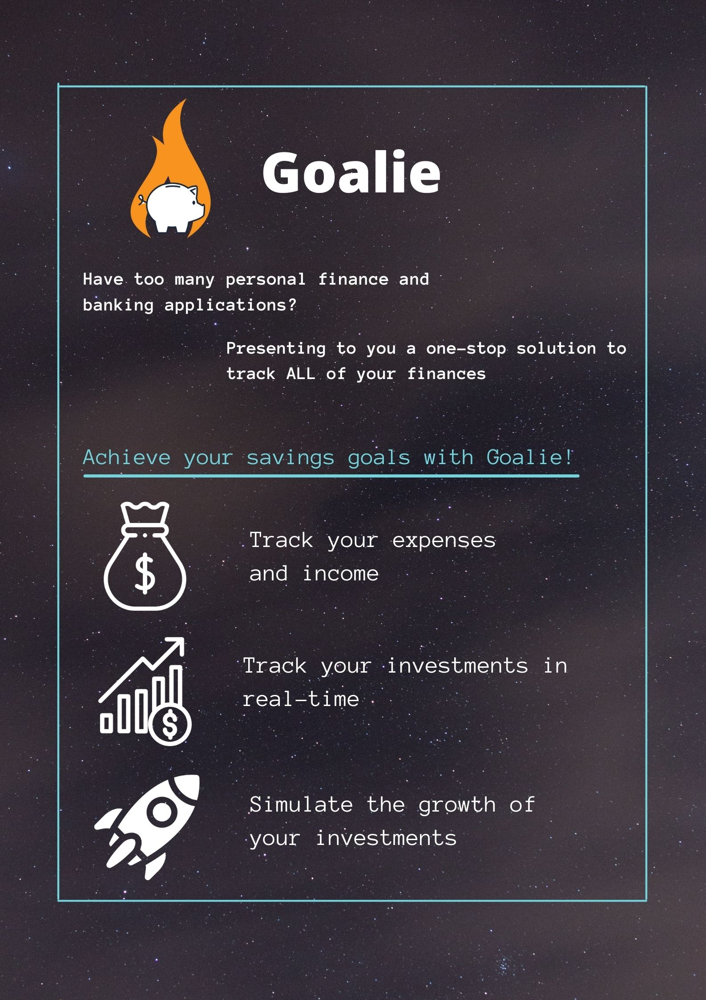

# Goalie

  
<h2 style="display: inline-block">Table of Contents</h2>

  <ol>
    <li>
      <a href="#about-the-project">About The Project</a>
      <ul>
        <li><a href="#built-with">Built With</a></li>
      </ul>
    </li>
    <li><a href="#roadmap">Roadmap</a></li>
  </ol>

## About the project

Goalie seeks to help people keep track of their expenses and income, as well as investments, providing a goal-based solution to help individuals achieve their financial goals.
This is part of the module CP2106 Independent Software Development, also known as Orbital.  

### Built With
Programming languages: HTML, CSS, Javascript  
Frameworks: ReactJS, Bootstrap CSS

## Roadmap

Brought to you by Ivan and Xiao Guang 

