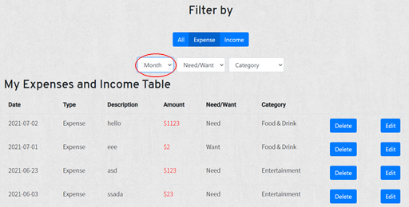

## Goalie User Guide

  
<h2 style="display: inline-block">Table of Contents</h2>

 <ol>
    <ul>
      <li> <a href="#quick-introduction"> Quick Introduction </a> </li>
      <li> <a href="#quick-start"> Quick Start </a> </li>
      <li> <a href="#feature-guide"> Feature guide </a> </li>
      <ul>
        <li><a href="#1-sign-up">Sign up</a></li>
        <li><a href="#2-login">Log in</a></li>
        <li><a href="#3-set-a-savings-goal">Set a savings goal</a></li>
        <li><a href="#4-track-your-expenses-and-income">Track your expenses and income</a></li>
      <ul>
         <li><a href="#4a-adding-an-expense"> Adding an expense </a></li>
         <li><a href="4b-adding-an-income"> Adding an income </a></li>
      </ul>
        <li><a href="#5-deleting-and-editing-entries-in-my-expenses-and-income-table"> Deleting and Editing entries in "My Expense and Income Table" </a></li>
        <ul>
          <li><a href="#5a-deleting-entries"> Deleting Entries </a></li>
          <li><a href="#5b-editing-entries"> Editing Entries </a></li>
        </ul>
      <li><a href="#6-filtering-entries-in-my-expenses-and-income-table"> Filtering entries in "My Expenses and Income Table" </a></li>
      <ul>
        <li><a href="#6a-default-filter-both-expenses-and-income"> Default filter (both expenses and income) </a></li>
        <ul>
          <li><a href="#6ai-filter-expenses-and-income-by-month"> Filter expenses and income by month </a></li>
        </ul>
        <li><a href="#6b-filtering-expenses-only"> Filtering expenses only </a> </li>
        <ul>
          <li><a href="#6bi-filtering-expenses-by-month">Filtering expenses by month</a> </li>
          <li><a href="#6bii-filtering-expenses-by-need-or-want">Filtering expenses by need or want</a></li>
          <li><a href="#6biii-filtering-expenses-by-category">Filtering expenses by category</a></li>
        </ul>
        <li><a href="#6c-filtering-income-only">Filtering income only</a></li>
        <ul>
          <li><a href="#6ci-filtering-income-by-month">Filtering income by month</a></li>
          <li><a href="#6cii-filtering-income-by-category">Filtering incomy by category</a></li>
        </ul>
        </ul>
        <li><a href="#7-resetting-filters">Resetting filters</a></li>
        <li><a href="#8-viewing-the-dashboard-descriptive-statistics">Viewing the dashboard: Descriptive statistics</a></li>
        <ul>
          <li><a href="#8a-breakdown"> Breakdown </a></li>
          <li><a href="#8b-need-and-want-pie-chart"> Need and want pie chart </a></li>
        </ul>
        <li><a href="#9-viewing-the-dashboard-analysis">Viewing the dashboard: Analysis</a></li>
        <li><a href="#10-track-your-investments-coming-soon">Track your investments</a></li>
        <ul>
          <li><a href="#10a-add-a-stock-transaction">Add a stock transaction </a></li>
          <li><a href="10b-delete-a-stock-transaction">Delete a stock transaction </a></li>
          <li><a href="10c-edit-a-stock-transaction">Edit a stock transaction </a></li>
        </ul>
    </ul>
  </ol>

### 

## Quick Introduction 
Goalie is your companion in financial planning. Goalie helps you plan for your finances better by giving you an all-in-one solution that will help you:

1. Save money by allowing you to set a savings goal
2. Track your expenses and income
3. Track your investments *(Coming soon!)*

### Quick Start 
Step 1: Start by accessing our website: [https://csb-rn409.vercel.app/](https://csb-rn409.vercel.app/)
Step 2: Sign up for a free account by clicking on the following button (Figure 1). *Note: Each email can only be used to create 1 account.*

\
Figure 1: Click the “Sign up for a free account” button

\
Figure 2: Or Click the “Sign up” button on the navigation bar

\
Figure 3: Enter your email address and password and you’re all set!

## Feature Guide

### 1. Sign up
Refer to [Quick Start ](#quick-start)

### 2. Login
*Note that you must have a working, valid account with us before proceeding. Refer to **[Quick Start](#quick-start)** if you do not have an account.*

On our [website](https://csb-rn409.vercel.app/), click on the “Log in” button on the navigation bar (Figure 4). Enter your login information and click “Log in” (Figure 5). You will be brought to the dashboard page.

\
Figure 4: The navigation bar of the main page. Click on “Log in”

\
Figure 5: Enter your login information

### 3. Set a Savings Goal 
Once you have signed up or logged in, you should be on the dashboard page. Otherwise, navigate to the dashboard by clicking “Dashboard” on the navigation bar (Figure 6).

\
Figure 6: Click on Dashboard

Set a savings goal by entering your savings goal **(for the current month)** (Figure 7). Then, simply press set (Figure 8). Your savings goal should be reflected on the page immediately. *Note: Saving Goal cannot be negative.*

\
Figure 7: Enter your savings goal. Any amount counts!

\
Figure 8: Click “Set” and your savings goal will be reflected.

Now, having set a goal, it is time to achieve it. Start [keeping track of your expenses and income](#4-track-your-expenses-and-income).

### 4. Track Your Expenses and Income
Get started by navigating to the Income & Expenditure page. This is accessible from the navigation bar (Figure 9).

\
Figure 9: Navigate to Income & Expenditure

#### 4a. Adding an Expense

By default, you are able to add an expense. In the form, indicate the date of expense, a short description of the expense, amount, category, and whether the expense was a need or a want (Figure 10).

<a name="rule"> Note: All fields have to be filled in with valid input (No future dates, purely numerical descriptions, or non-positive amounts are allowed). </a>

Currently, our expense categories are “Food & Drink”, “Entertainment”, “Others”.

Not sure whether your expense was a need or want? Refer to this [link](https://www.makingsenseofcents.com/2017/06/wants-and-needs.html) for more information.

\
Figure 10: Add an expense by filling in the details

Next, click the “add” button. Your expense should appear on the Expense and Income Table below (Figure 11).

\
Figure 11: Expenses and Income Table

#### 4b. Adding an Income

If you want to add an income instead, simply toggle the Income button and the form will change to one that will allow you to add an income (Figure 12). Add the needed details accordingly.

*The **[rules](#rule)** for adding an expense apply here as well.*

\
Figure 12: Toggle the income button. Notice that the form changes (Why? Because Income cannot be categorized as “need” or “want”)

Click the “Add” button and it will be recorded in the Expenses and Income table (Figure 13).

\
Figure 13: Once “Add” is clicked, the income will be reflected in the table below

### 5. Deleting and Editing Entries in “My Expenses and Income Table”

Did you mess up an entry? Don’t fret, because Goalie supports Delete and Edit operations!

Get started by navigating to the Income & Expenditure page. This is accessible from the navigation bar (Figure 14).

\
Figure 14: Navigate to Income & Expenditure

#### 5a. Deleting Entries

To delete an entry, simply click the respective delete button located at the right of the entry (Figure 15). Once clicked, the entry will be deleted from the table. This operation cannot be undone.

\
Figure 15: Click the “Delete” button to delete an entry

#### 5b. Editing Entries

To edit an entry, click the respective edit button located at the right of the entry (Figure 16).
\
Figure 16: Click the “Edit” button to edit an entry

Next, a popup form should appear. You may edit any of the fields. Once done, click “Save changes” for the changes to be reflected in the table (Figure 17).

*Note: The same **[rules](#rule)** for adding expenses or income apply here.*

\

Figure 17: The edit form that will appear if you click “edit”. Click “save changes” for the change to take effect

### 6. Filtering entries in “My Expenses and Income Table”
“My Expenses and Income Table” also supports filtering operations! View your expenses and income by adding a filter of your choice.

Get started by navigating to the Income & Expenditure page. This is accessible from the navigation bar (Figure 18).

\
Figure 18: Navigate to Income & Expenditure

#### 6a. Default filter (both expenses and income)
The default filter can be applied by clicking on the “All” toggle button under “Filter by”. This component can be found above the “My Expenses and Income Table”. This will display** all **expenses and income (Figure 19).

\
Figure 19: Apply the default filter by clicking on “All”

#### 6ai. Filter expenses and income by month
You may also apply the month filter to filter expenses and income by the chosen month. Click on the dropdown labeled “Month” and click on the desired month (Figure 20). Refer to Figures 20-22 for a full demonstration.

*Do note that not all 12 months will be shown. Only months in which you have expenses and income will be reflected in the dropdown. This also applies to “Filter expenses by month” and “filter income by month”.*

\
Figure 20: Click on the month dropdown and click on the desired month. In this example, the user’s table has transactions in June and July.

\
<a name="demo"> Figure 21: Demonstration - The user clicks on 06 (June) </a>

\
Figure 22: Demonstration - Expenses and income in the month of June will be shown

#### 6b. Filtering Expenses only

Apply the expense filter by clicking on the “Expense” toggle button (Figure 23). This will display all expenses only.
\
Figure 23: Click on the “Expense” toggle button and only expenses will be displayed

#### 6bi. Filtering expenses by month
If you would like to view your expenses by the month,
1. Have “Expense” toggled on
2. Select the desired month by clicking on the “Month” dropdown (Figure 24)

\
Figure 24: Click on the desired month after clicking on the “Month” dropdown

For example, if “07” was selected, then expenses in the month of July will be shown. Refer to this [demonstration](#demo) which performs a similar operation.

#### 6bii. Filtering expenses by Need or Want
If you would like to view your expense by whether the expense was a “Need” or a “Want”,
1. Have “Expense” toggled on
2. Select “Need” or “Want by clicking on the “Need/Want” dropdown (Figure 25)

\
Figure 25: Click on “Need” or “Want” after clicking on the “Need/Want” dropdown

For example, if “Need” was selected, then “Need” expenses will be shown. Refer to figures 26-27 for a full demonstration.

\
Figure 26: “Need” is chosen from the “Need/Want” dropdown

\
Figure 27: “Need” Expenses are displayed

#### 6biii. Filtering expenses by Category
If you would like to view your expense by category
3. Have “Expense” toggled on
4. Select the desired category by clicking on the “Category” dropdown (Figure 28)

\
Figure 28: Click on “Category” and select the desired category
For example, if “Food & Drink” was selected, then expenses of the category “Food & Drink” will be displayed. Refer to figures 29-30 for a full demonstration.

\
Figure 29: “Food & Drink” is selected from the “Category” dropdown

\
Figure 30: Expenses with the Category “Food & Drink” is displayed

#### 6c. Filtering Income only
Apply the expense filter by clicking on the “Expense” toggle button (Figure 31). This will display all income only.
\
Figure 31: Click on the “Income” toggle button and only income will be displayed

#### 6ci. Filtering income by month
If you would like to view your income by the month,
3. Have “Income” toggled on
4. Select the desired month by clicking on the “Month” dropdown (Figure 32)

\
Figure 32: Click on the desired month after clicking on the “Month” dropdown

For example, if “07” was selected, then income in the month of July will be shown. Refer to this [demonstration](#demo) which performs a similar operation.

#### 6cii. Filtering income by Category
If you would like to view your expense by category
5. Have “Income” toggled on
6. Select the desired category by clicking on the “Category” dropdown (Figure 33)

\
Figure 33: Click on “Category” and select the desired category

For example, if “Allowance” was selected, then the income of the category “Allowance” will be displayed. Refer to this [demonstration](#demo) which performs a similar operation.

### 7. Resetting filters
Filters can be reset by selecting the original state of the desired dropdown.

For example:
1. If I want to reset my “Month” filter to show all months, I should choose “Month” from the dropdown (Figures 34-35)
2. If I want to reset my “Category” filter to show all categories, I should choose “Category” from the dropdown (Figures 36-37)

\
Figure 34: Currently in “07”, showing July Expenses

\
Figure 35: Reset the month filter by choosing “Month” in the dropdown and all expenses will be shown
\
Figure 36: Currently in “Entertainment”, showing Expenses of category “Entertainment”

\
Figure 37: Reset the category filter by choosing “Category” in the dropdown and all expenses will be shown

Furthermore, when toggling through “All”, “Expense” and “Income”, it is guaranteed that all filters will be reset.

For example, If I am currently viewing Expenses in the month of July, with the category “Food & Drink”, once I toggle over to “Income”, I will be viewing all Income with no filters applied.

### 8. Viewing the Dashboard: Descriptive Statistics

*This section will not be helpful if you have not set a savings goal or have not tracked your expenses and income. Find out more about **[setting a savings goal](#3-set-a-savings-goal)**, or find out more about **[tracking your expenses and income ](#4-track-your-expenses-and-income)*

*Also, take note that all descriptive statistics are for the **current month**.*

To view the dashboard, simply navigate to the dashboard by clicking on “Dashboard” in the navigation bar. Goalie shows you two kinds of descriptive statistics (for now):

#### 8a. Breakdown

Goalie aggregates your want expenses, need expenses, and total expenses for the current month. View them under “Breakdown” (Figure 38).

\
Figure 38: An example of a breakdown of expenses under breakdown

#### 8b. Need and Want Pie Chart

Goalie helps you segregate and aggregate your expenses by whether they are a need expense or a want expense. You can very quickly find out your total want expenses and need expenses for the month and their relative proportion of the total expenses for the month by referring to the need and want pie chart in the dashboard (Figure 39).

\
Figure 39: An example of a need and want expense pie chart. (Clearly, I have been spending a lot less on wants than needs, which is ideal!)

### 9. Viewing the Dashboard: Analysis 

Goalie evaluates your spending habits and savings goal to determine how much you can afford to spend for the day.

It will also tell you on average, how much money you have been spending per day.

Lastly, Goalie will keep you on track to achieve your savings goal by making recommendations based on your spending habits.

\
Figure 40: Recommendation example 1

\
Figure 41: Recommendation example 2

### 10. Track your investments 
#### 10a. Add a stock transaction
Goalie allows users to track their investments (stock tickers).

Navigate to the Investments page on the navigation bar.

 \
Figure 42: Navigate to the investments page

In the form, fill in the following details: The date of transaction, the stock ticker, number of units of stock bought, and cost price per unit of stock.

Note: All fields have to be filled in with valid input (No future dates or non-positive amounts are allowed).

Once the details are filled in, click “add” (Figure 43) to add the stock transaction to the stock table below the form (Figure 44).

 \
Figure 43: Add a stock transaction
 \
Figure 44: The stock transaction will be added to the table below

#### 10b. Delete a stock transaction
Delete your stock transaction by clicking the “delete” button on the right of the transaction that you wish to delete (Figure 45).

 \
Figure 45: Click to delete the transaction

#### 10c. Edit a stock transaction
Edit a stock transaction by clicking the “edit” button on the right of the transaction that you wish to edit (Figure 46). A modal will appear. Fill in the details you wish to edit and click the “Save Changes” button once you are done (Figure 47). The transaction will be updated automatically in the table.

 \
Figure 46: Click to edit the transaction
 \
Figure 47: The edit modal

#### 10d. View your Stocks’ Profit and Loss summary on the Dashboard page
Once you have added your stock transactions, navigate to the dashboard page via the navigation bar (Figure 48). Your Stocks’ Profit and Loss will be displayed in a List. The first entry will be the net profit and loss, followed by the individual stocks’ profit and loss (Figure 49).

 \
Figure 48: Navigate to the dashboard page

 \
Figure 49: Your Stocks’ Profit and Loss will be displayed in a List

 
